<!-- README.md is generated from README.Rmd. Please edit that file -->

# X<sub>CO2</sub> E SIF NA AMAZÔNIA LEGAL: UMA ANÁLISE ESPAÇO-TEMPORAL COM APRENDIZADO DE MÁQUINA

## 👩‍🔬 Autores

- **Gabriela Pereira da Cruz**  
  Graduanda em Engenharia Agronômica - FCAV/Unesp  
  Email: <gabriela.p.cruz@unesp.br>

- **Prof. Dr. Alan Rodrigo Panosso**  
  Coorientador — Departamento de Ciências Exatas - FCAV/Unesp  
  Email: <alan.panosso@unesp.br>

## 📁 Etapas do Projeto

### ⬇️ Aquisição dos dados brutos

- **Aquisição e download dos dados brutos** [OCO-2 e
  OCO-3](https://disc.gsfc.nasa.gov):

### 🔗 Links para Download dos dados compilados:

| Dados Processados Para Download |
|:--:|
| [data-set-xco2-amazon.rds](https://drive.google.com/file/d/1DYmiwn7E2QOcy8yiued1pF6Aw9XKoA-z/view?usp=sharing) ⬇️ |
| [data-set-sif.rds](https://drive.google.com/file/d/1Tvy4T2O3YwY9sQwvHnDD3sZWkoqvwZbw/view?usp=sharing) ⬇️ |
| [data-set-sif-amazon.rds](https://drive.google.com/file/d/1Jfkd8566EY9ZCCb8SczEwEfBDB7Pjq3W/view?usp=sharing) ⬇️ |
| [data-set-xco2-anomal.rds](https://drive.google.com/file/d/1an-4L0E7reDeRmEJ69_l1pF6TSD0SVG3/view?usp=sharing) ⬇️ |

Formato dos arquivos:

> .rds (formato nativo do R para carregamento rápido)

> salve os arquivos na pasta `data` do projeto

### 1 🧹 Preparação de dados

``` r
library(tidyverse)
library(geobr)
library(sp)
```

#### Carregando os polígonos do Brasil

Carregando os polígonos para o Brasil e para a Amazônia Legal

``` r
country_br <- geobr::read_country(showProgress = FALSE, year = 2020)
amazon <- geobr::read_amazon(showProgress = FALSE, year = 2020)
states <- read_state(showProgress = FALSE, year = 2020)
```

Vizualizando o mapa da amazônia legal

``` r
amazon |> 
  ggplot() +
  geom_sf(fill="green4") +
  theme_bw()
```

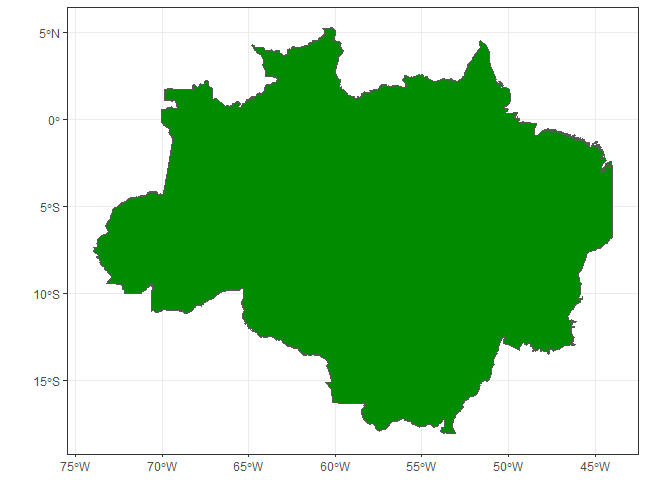<!-- -->

#### Carregando os dados

Carregando os dados criando variáveis temporais a partir da coluna
`time` do data set original.

``` r
tictoc::tic()
data_set_xco2 <- readr::read_rds("data/data-set-xco2-amazon.rds") |> 
  dplyr::mutate(
    time = lubridate::as_datetime(time, tz = "America/Sao_Paulo"),
    year = lubridate::year(time),
    month = lubridate::month(time),
    day = lubridate::day(time),
  )
tictoc::toc()
#> 1.7 sec elapsed
```

Resumo rápido do banco de dados

``` r
dplyr::glimpse(data_set_xco2)
#> Rows: 2,072,749
#> Columns: 16
#> $ longitude         <dbl> -57.24859, -60.25506, -60.25922, -60.26331, -60.2603…
#> $ latitude          <dbl> -16.006199, -2.370965, -2.352430, -2.333827, -2.3444…
#> $ time              <dttm> 2020-01-02 14:26:32, 2020-01-02 14:30:34, 2020-01-0…
#> $ xco2              <dbl> 408.3632, 410.4371, 411.5206, 411.4840, 413.7887, 41…
#> $ xco2_quality_flag <int> 1, 1, 1, 1, 1, 1, 1, 1, 1, 1, 1, 1, 1, 1, 1, 1, 1, 1…
#> $ xco2_incerteza    <dbl> 0.6413727, 0.5051642, 0.5171114, 0.5131139, 0.517742…
#> $ path              <chr> "data-raw/2020/OCO2/oco2_LtCO2_200102_B11210Ar_24091…
#> $ year              <dbl> 2020, 2020, 2020, 2020, 2020, 2020, 2020, 2020, 2020…
#> $ month             <dbl> 1, 1, 1, 1, 1, 1, 1, 1, 1, 1, 1, 1, 1, 1, 1, 1, 1, 1…
#> $ day               <int> 2, 2, 2, 2, 2, 2, 2, 2, 2, 2, 2, 2, 2, 2, 2, 2, 2, 2…
#> $ flag_norte        <lgl> FALSE, TRUE, TRUE, TRUE, TRUE, TRUE, TRUE, TRUE, TRU…
#> $ flag_nordeste     <lgl> FALSE, FALSE, FALSE, FALSE, FALSE, FALSE, FALSE, FAL…
#> $ flag_sul          <lgl> FALSE, FALSE, FALSE, FALSE, FALSE, FALSE, FALSE, FAL…
#> $ flag_centroeste   <lgl> TRUE, FALSE, FALSE, FALSE, FALSE, FALSE, FALSE, FALS…
#> $ flag_suldeste     <lgl> FALSE, FALSE, FALSE, FALSE, FALSE, FALSE, FALSE, FAL…
#> $ flag_amazon       <int> 1, 1, 1, 1, 1, 1, 1, 1, 1, 1, 1, 1, 1, 1, 1, 1, 1, 1…
```

Resumo Completo do Banco de dados

``` r
skimr::skim(data_set_xco2)
```

|                                                  |               |
|:-------------------------------------------------|:--------------|
| Name                                             | data_set_xco2 |
| Number of rows                                   | 2072749       |
| Number of columns                                | 16            |
| \_\_\_\_\_\_\_\_\_\_\_\_\_\_\_\_\_\_\_\_\_\_\_   |               |
| Column type frequency:                           |               |
| character                                        | 1             |
| logical                                          | 5             |
| numeric                                          | 9             |
| POSIXct                                          | 1             |
| \_\_\_\_\_\_\_\_\_\_\_\_\_\_\_\_\_\_\_\_\_\_\_\_ |               |
| Group variables                                  | None          |

Data summary

**Variable type: character**

| skim_variable | n_missing | complete_rate | min | max | empty | n_unique | whitespace |
|:--------------|----------:|--------------:|----:|----:|------:|---------:|-----------:|
| path          |         0 |             1 |  63 |  63 |     0 |     2550 |          0 |

**Variable type: logical**

| skim_variable   | n_missing | complete_rate | mean | count                     |
|:----------------|----------:|--------------:|-----:|:--------------------------|
| flag_norte      |         0 |             1 | 0.56 | TRU: 1169710, FAL: 903039 |
| flag_nordeste   |         0 |             1 | 0.08 | FAL: 1916299, TRU: 156450 |
| flag_sul        |         0 |             1 | 0.00 | FAL: 2072749              |
| flag_centroeste |         0 |             1 | 0.36 | FAL: 1326132, TRU: 746617 |
| flag_suldeste   |         0 |             1 | 0.00 | FAL: 2072749              |

**Variable type: numeric**

| skim_variable | n_missing | complete_rate | mean | sd | p0 | p25 | p50 | p75 | p100 | hist |
|:---|---:|---:|---:|---:|---:|---:|---:|---:|---:|:---|
| longitude | 0 | 1 | -55.49 | 6.55 | -73.97 | -59.55 | -55.12 | -50.36 | -44.00 | ▂▃▇▇▆ |
| latitude | 0 | 1 | -9.33 | 4.63 | -18.04 | -12.66 | -9.70 | -6.63 | 5.00 | ▃▇▆▂▁ |
| xco2 | 0 | 1 | 416.16 | 11.08 | 330.01 | 412.93 | 415.86 | 419.08 | 4425.28 | ▇▁▁▁▁ |
| xco2_quality_flag | 0 | 1 | 0.54 | 0.50 | 0.00 | 0.00 | 1.00 | 1.00 | 1.00 | ▇▁▁▁▇ |
| xco2_incerteza | 0 | 1 | 0.63 | 0.16 | 0.20 | 0.51 | 0.60 | 0.71 | 4.46 | ▇▁▁▁▁ |
| year | 0 | 1 | 2021.80 | 1.40 | 2020.00 | 2021.00 | 2022.00 | 2023.00 | 2024.00 | ▇▇▆▆▅ |
| month | 0 | 1 | 7.17 | 2.06 | 1.00 | 6.00 | 7.00 | 8.00 | 12.00 | ▁▂▇▆▂ |
| day | 0 | 1 | 15.34 | 9.62 | 1.00 | 6.00 | 16.00 | 24.00 | 31.00 | ▇▅▃▅▆ |
| flag_amazon | 0 | 1 | 1.00 | 0.00 | 1.00 | 1.00 | 1.00 | 1.00 | 1.00 | ▁▁▇▁▁ |

**Variable type: POSIXct**

| skim_variable | n_missing | complete_rate | min | max | median | n_unique |
|:---|---:|---:|:---|:---|:---|---:|
| time | 0 | 1 | 2020-01-01 12:54:37 | 2024-12-31 09:32:34 | 2022-05-31 14:27:11 | 2072685 |

``` r
amazon |> 
  ggplot() +
  geom_sf(fill="green4") +
  theme_bw() +
  geom_point(data=data_set_xco2 |> 
  filter(year == 2020,
         flag_norte|flag_centroeste|flag_nordeste) |> 
  sample_n(1000), aes(longitude,latitude))
```

<!-- -->

### Filtrar o banco dados para amazônia legal

Extraindo os polígonos da amazônia e salvando as respectivas coordenadas
x - logitude e y - latitude, para posteriormente ser utilizada na função
de classificação de pontos.

``` r
pol_amazon <- amazon$geometry[[1]] |> as.matrix()
pol_amazon_x <- pol_amazon[,1]
pol_amazon_y <- pol_amazon[,2]
# plot(pol_amazon_x,pol_amazon_y)
```

Criando a flag_amazon para posterior filtragem do banco de dados e
salvando essa nova versão na pasta data.

``` r
 #tictoc::tic()
 #data_set_xco2_amazon <- data_set_xco2 |>
#filter(flag_norte|flag_centroeste|flag_nordeste) |>
 #  mutate(
  #   flag_amazon = sp::point.in.polygon(longitude,latitude,
                                       # pol.x = pol_amazon_x,
                                       # pol.y = pol_amazon_y))
 #tictoc::toc()
 #data_set_xco2_amazon$flag_amazon |> unique()
 #write_rds(data_set_xco2_amazon |> 
  #           filter(flag_amazon == 1),"data/data-set-xco2-amazon.rds")
```

Lendo o data set amazon

``` r
data_set_xco2_amazon <- read_rds("data/data-set-xco2-amazon.rds")

amazon |> 
  ggplot() +
  geom_sf(fill="green4") +
  theme_bw() +
  geom_point(data=data_set_xco2_amazon |> 
  filter(year == 2024,
         flag_amazon == 1) |> 
  sample_n(1000), aes(longitude,latitude))
```

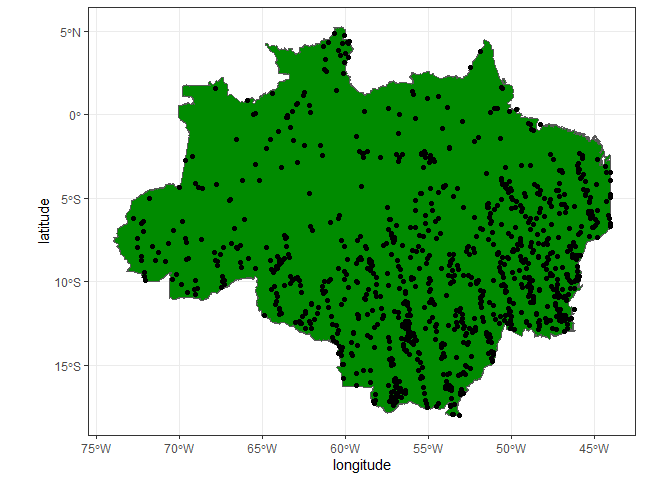<!-- -->

``` r
amazon |> 
  ggplot() +
  geom_sf(fill="green4") +
  theme_bw() +
  geom_point(data=data_set_xco2 |> 
  filter(year == 2020,
         flag_norte|flag_centroeste|flag_nordeste) |> 
  sample_n(1000), aes(longitude,latitude))
```

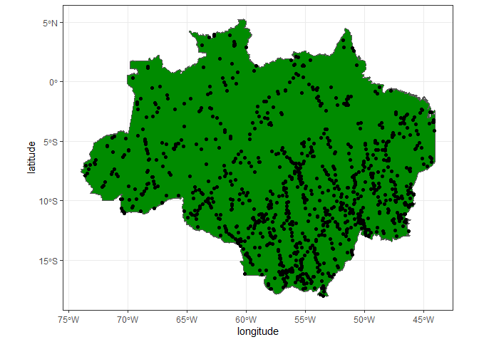<!-- -->

### Ajustando para SIF

``` r
tictoc::tic()
data_set_sif <- readr::read_rds("data/data-set-sif.rds") |> 
  dplyr::mutate(
    time = lubridate::as_datetime(time, origin = "1990-01-01 00:00:00",
                                   tz = "America/Sao_Paulo"),
    year = lubridate::year(time),
    month = lubridate::month(time),
    day = lubridate::day(time),
  )
tictoc::toc()
#> 17.17 sec elapsed
```

Resumo rápido do banco de dados

``` r
dplyr::glimpse(data_set_sif)
#> Rows: 27,462,772
#> Columns: 17
#> $ time               <dttm> 2020-01-01 13:41:22, 2020-01-01 13:41:23, 2020-01-…
#> $ sza                <dbl> 24.44861, 24.44421, 24.43042, 24.42725, 24.41541, 2…
#> $ vza                <dbl> 0.15972900, 0.15936279, 0.36914062, 0.25946045, 0.4…
#> $ saz                <dbl> 264.3497, 264.1766, 264.1306, 263.6334, 263.6737, 2…
#> $ vaz                <dbl> 349.4449463, 349.2926025, 9.9569092, 0.1663208, 11.…
#> $ longitude          <dbl> -42.86682, -42.88593, -42.90643, -42.95166, -42.962…
#> $ latitude           <dbl> -22.83197, -22.75171, -22.72925, -22.49982, -22.517…
#> $ sif740             <dbl> 2.0291252, 1.9367952, 1.2935743, -0.2750387, 2.0776…
#> $ sif740_uncertainty <dbl> 0.4810228, 0.4750776, 0.5201931, 0.5690994, 0.62952…
#> $ daily_sif740       <dbl> 0.78077316, 0.74496078, 0.49750042, -0.10566425, 0.…
#> $ daily_sif757       <dbl> 0.51616192, 0.69380951, 0.22501564, 0.10593128, 0.3…
#> $ daily_sif771       <dbl> 0.34991264, 0.19964695, 0.29221249, -0.16454506, 0.…
#> $ quality_flag       <int> 0, 1, 0, 2, 2, 0, 0, 0, 0, 0, 1, 0, 1, 0, 0, 1, 0, …
#> $ path               <chr> "data-raw/2020/OCO2 SIF/oco2_LtSIF_200101_B11012Ar_…
#> $ year               <dbl> 2020, 2020, 2020, 2020, 2020, 2020, 2020, 2020, 202…
#> $ month              <dbl> 1, 1, 1, 1, 1, 1, 1, 1, 1, 1, 1, 1, 1, 1, 1, 1, 1, …
#> $ day                <int> 1, 1, 1, 1, 1, 1, 1, 1, 1, 1, 1, 1, 1, 1, 1, 1, 1, …
```

Resumo Completo do Banco de dados

### CRIANDO FLAG SIF

Criando a flag_amazon para posterior filtragem do banco de dados e
salvando essa nova versão na pasta data.

### Baixar o Poligono da Amazonia Legal

``` r
#Amazonia Legal 
# amazon <- geobr::read_amazon(showProgress = FALSE)
para_pol <- states$geometry[5] |> purrr::pluck(1) |> as.matrix()
amazon_pol <- amazon$geometry |> purrr::pluck(1) |> as.matrix()
amazonas_pol <- states$geometry[3] |> purrr::pluck(1) |> as.matrix()
```

``` r
# data_set_sif_amazon <- readRDS("data/data-set-sif.rds")
# # Classificação de pertencimento de ponto em polígono
# def_pol <- function(x, y, pol){
#   as.logical(sp::point.in.polygon(point.x = x,
#                                   point.y = y,
#                                   pol.x = pol[,1],
#                                   pol.y = pol[,2]))
# }
# 
# tictoc::tic()
# data_set_sif_amazon <- data_set_sif |>
#   dplyr::mutate(
#     flag_amazon = def_pol(longitude, latitude, amazon_pol)
#   ) |>
#   dplyr::filter(flag_amazon == TRUE)
# tictoc::toc()
# 
# write_rds(
#   data_set_sif_amazon,
#   "data/data-set-sif-amazon.rds"
# )

# tictoc::tic()
# data_set_sif_amazon <- data_set_sif |>
#   dplyr::filter(year == 2020) |>
#   dplyr::mutate(
#     flag_amazon = def_pol(longitude, latitude, amazon_pol)
#   ) |>
#   dplyr::filter(flag_amazon == TRUE)
# tictoc::toc()
# set.seed(123)
# data_set_sif_amazon_sample <- data_set_sif_amazon |>
#   dplyr::sample_n(1000)

data_set_sif_amazon <- read_rds("data/data-set-sif-amazon.rds")
```

``` r
data_set_sif_amazon |>
  ggplot() +
  geom_sf(data = amazon, fill = "green4") +
  theme_bw() +
  geom_point(
    data = data_set_sif_amazon |>
      dplyr::filter(
        year == 2020,
      ) |>
      dplyr::sample_n(1000),
    aes(longitude, latitude),
    size = 0.8
  )
```

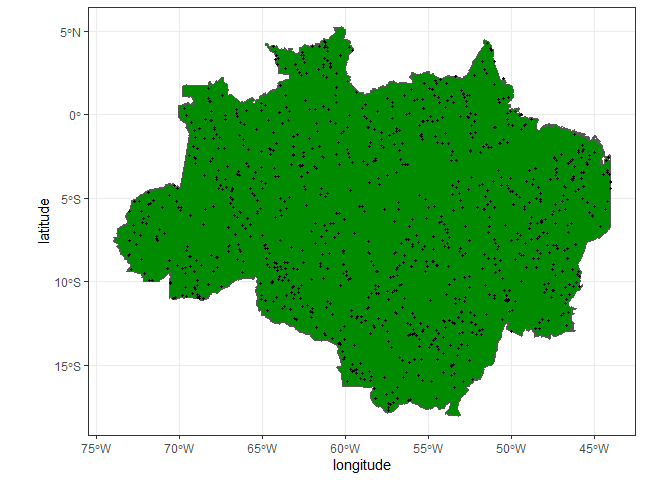<!-- -->

### 2 🔎 Análises iniciais

#### Carregando pacotes

``` r
library(ggridges)
library(ggpubr)
library(gstat)
library(vegan)
```

#### FAXINA E TRATAMENTO DOS DADOS DE SIF

``` r
# data_set_sif <- data_set_sif %>%
#   filter(quality_flag==0) |>
#   dplyr::mutate(
#     #time = lubridate:: as_datetime(time,
#                                    #origin = "1990-01-01 00:00:00",
#                                    #tz = "America/Sao_Paulo"),
#     year = lubridate:: year(time),
#     month = lubridate::month(time),
#     day = lubridate::day(time),
#     date = make_date(year, month, day),
#     sif = (daily_sif757 + 1.5*daily_sif771)/2
#     ) |>
#   select(longitude, latitude, date, sif, daily_sif757, daily_sif771, quality_flag, year, month, day)

#dplyr::glimpse(data_set_sif)
#summary(data_set_sif$date)
#write_rds(data_set_sif, "../data/data-set-sif-amazon.rds")
```

#### Visualização de Histograma SIF

``` r
data_set_sif_amazon |>
  # filter(year == 2020) |> 
  ggplot(aes(x = daily_sif757)) +
  geom_histogram(color="black",fill="gray",
                          bins = 30) +
  # coord_cartesian(xlim = c(-2, 2) , ylim = c(0, 600000))+
  facet_wrap(~year, scales = "free") +
  theme_bw()
```

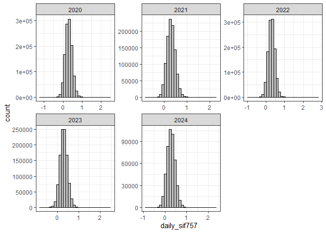<!-- --> \####
Estatistica do SIF

``` r
dados_sif_mensais <- data_set_sif_amazon %>%
  group_by(year, month) %>%
  summarise(
    sif_media = mean(sif , na.rm = TRUE),
    sif_sd = sd(sif , na.rm = TRUE),
    .groups = "drop"  
  ) %>%
  mutate(
    data = as.Date(paste(year, month, "15", sep = "-")),
    epoca = case_when(
      month %in% 1:6  ~ "1° semestre (Jan-Jun)",
      month %in% 7:12 ~ "2° semestre (Jul-Dez)"
    ),
    epoca = factor(epoca, levels = c("1° semestre (Jan-Jun)", "2° semestre (Jul-Dez)"))
  ) %>%
  arrange(data)
ggplot(dados_sif_mensais, aes(x = data, y = sif_media, color = epoca, fill = epoca)) +
  geom_ribbon(aes(ymin = sif_media - sif_sd, ymax = sif_media + sif_sd), alpha = 0.3, color = NA) +
  geom_line(linewidth = 1) +
  geom_point(size = 2.5) +
  scale_color_manual(values = c("1° semestre (Jan-Jun)" = "blue", "2° semestre (Jul-Dez)" = "orange")) +
  scale_fill_manual(values = c("1° semestre (Jan-Jun)" = "blue", "2° semestre (Jul-Dez)" = "orange")) +
  scale_x_date(
    breaks = "1 year",  
    date_labels = "%b %Y"
  ) +
  labs(
    # title = "Série Temporal Mensal de XCO₂ SEM tendencia",
    # subtitle = "Média e Desvio Padrão para cada mês, com cores por época",
    x = "Data",
    y = "Concentração Média de SIF (Wm−2 sr−1 μm−1)",
    color = "Época",
    fill = "Época"
  ) +
  theme_minimal() +
  theme(
    legend.position = "bottom",
    axis.text.x = element_text(angle = 45, hjust = 1)
  )
```

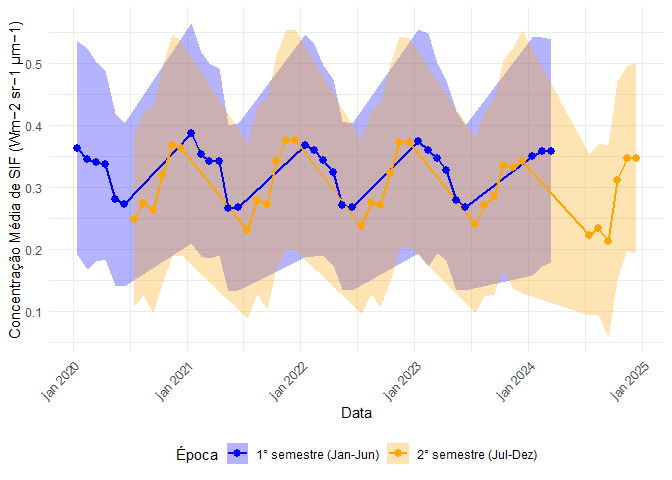<!-- --> \####
Carregando os dados de xco2 e filtrar - CONTINUAR DAQUI

``` r
# data_set_xco2_amazon <- readr::read_rds("../data/data-set-xco2-amazon00.rds")
# 
#  data_set_xco2_amazon <- data_set_xco2_amazon %>%
#    mutate(
#      date = lubridate::make_date(year, month, day)
#    )
# # write_rds(data_set_xco2_amazon, "../data/data-set-xco2-amazon.rds")
```

``` r
## Chamando meu banco de XCO2

#  data_set_xco2_amazon <- readr::read_rds("../data/data-set-xco2-amazon.rds")
# 
#  data_set_xco2_anomal <- data_set_xco2_amazon |>
# filter(xco2_quality_flag == 0) |>
#    group_by(date) |>
#    nest() |>
#    mutate(nobs = purrr::map_int(data, nrow)) |>
#    filter(nobs >= 5) |>
#    ungroup() |>
#    mutate(data = purrr::map(data, ~ dplyr::mutate(.x, xco2_anomalia = .x$xco2 - median(.x$xco2, na.rm = TRUE)))
#    ) |>
#    unnest(data)
#  glimpse(data_set_xco2_anomal)
# 
#  #write_rds(data_set_xco2_anomal, "../data/data-set-xco2-anomal.rds")
```

#### Criando coluna de semestre

``` r
data_set_xco2_anomal <- readr::read_rds("data/data-set-xco2-anomal.rds")
data_set_xco2_anomal <- data_set_xco2_anomal %>%
  mutate(
    epoca = case_when(
      month %in% 1:6   ~ "Jan_Jun",
      month %in% 7:12  ~ "Jul_Dez"
    )
  )
head(data_set_xco2_amazon)
#>   longitude   latitude                time     xco2 xco2_quality_flag
#> 1 -57.24859 -16.006199 2020-01-02 14:26:32 408.3632                 1
#> 2 -60.25506  -2.370965 2020-01-02 14:30:34 410.4371                 1
#> 3 -60.25922  -2.352430 2020-01-02 14:30:34 411.5206                 1
#> 4 -60.26331  -2.333827 2020-01-02 14:30:35 411.4840                 1
#> 5 -60.26037  -2.344424 2020-01-02 14:30:35 413.7887                 1
#> 6 -60.25745  -2.355058 2020-01-02 14:30:35 411.1546                 1
#>   xco2_incerteza
#> 1      0.6413727
#> 2      0.5051642
#> 3      0.5171114
#> 4      0.5131139
#> 5      0.5177423
#> 6      0.4935850
#>                                                              path year month
#> 1 data-raw/2020/OCO2/oco2_LtCO2_200102_B11210Ar_240913160615s.nc4 2020     1
#> 2 data-raw/2020/OCO2/oco2_LtCO2_200102_B11210Ar_240913160615s.nc4 2020     1
#> 3 data-raw/2020/OCO2/oco2_LtCO2_200102_B11210Ar_240913160615s.nc4 2020     1
#> 4 data-raw/2020/OCO2/oco2_LtCO2_200102_B11210Ar_240913160615s.nc4 2020     1
#> 5 data-raw/2020/OCO2/oco2_LtCO2_200102_B11210Ar_240913160615s.nc4 2020     1
#> 6 data-raw/2020/OCO2/oco2_LtCO2_200102_B11210Ar_240913160615s.nc4 2020     1
#>   day flag_norte flag_nordeste flag_sul flag_centroeste flag_suldeste
#> 1   2      FALSE         FALSE    FALSE            TRUE         FALSE
#> 2   2       TRUE         FALSE    FALSE           FALSE         FALSE
#> 3   2       TRUE         FALSE    FALSE           FALSE         FALSE
#> 4   2       TRUE         FALSE    FALSE           FALSE         FALSE
#> 5   2       TRUE         FALSE    FALSE           FALSE         FALSE
#> 6   2       TRUE         FALSE    FALSE           FALSE         FALSE
#>   flag_amazon
#> 1           1
#> 2           1
#> 3           1
#> 4           1
#> 5           1
#> 6           1
```

#### Visualização de Histograma xco2

``` r
data_set_xco2_anomal |>
  filter(year <2025) |>
  ggplot(aes(x=xco2)) +
  geom_histogram(color="black",fill="gray",
                          bins = 30) +
  coord_cartesian(xlim = c(395, 435) , ylim = c(0, 70000))+
  facet_wrap(~year, scales = "free") +
  theme_bw()
```

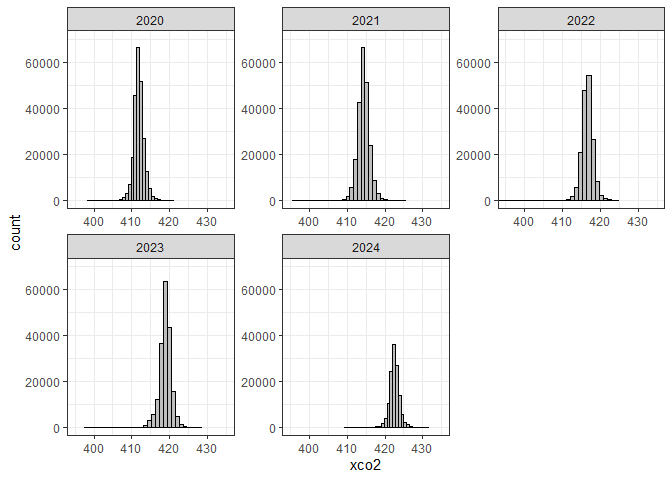<!-- -->

#### Tendencia regional, r2 e plotagem de gráfico

``` r
data_set_xco2_anomal |>
 sample_n(10000) |>
 drop_na() |>
 mutate( year = year - min(year)) |>
 ggplot(aes(x=time, y=xco2)) +
 geom_point() +
 geom_point(shape=21,color="black",fill="gray") +
 geom_smooth(method = "lm") +
 stat_regline_equation(aes(
 label =  paste(..eq.label.., ..rr.label.., sep = "*plain(\",\")~~"))) +
 theme_bw() +
 labs(x="Ano",y="xco2")
```

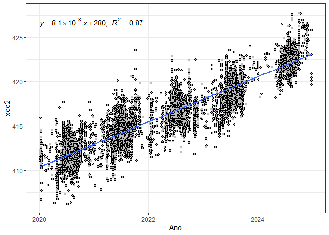<!-- -->

#### Análise da regressão linear simples para caracterização da tendencia XCO2

``` r
mod_trend_xco2 <- lm(xco2 ~ year,
                      data = data_set_xco2_anomal |>
                        filter(xco2_quality_flag == 0) |>
                        drop_na() |>
                        mutate( year = year - min(year))
 )
 mod_trend_xco2
#> 
#> Call:
#> lm(formula = xco2 ~ year, data = mutate(drop_na(filter(data_set_xco2_anomal, 
#>     xco2_quality_flag == 0)), year = year - min(year)))
#> 
#> Coefficients:
#> (Intercept)         year  
#>     411.766        2.528

 summary.lm(mod_trend_xco2)
#> 
#> Call:
#> lm(formula = xco2 ~ year, data = mutate(drop_na(filter(data_set_xco2_anomal, 
#>     xco2_quality_flag == 0)), year = year - min(year)))
#> 
#> Residuals:
#>      Min       1Q   Median       3Q      Max 
#> -23.5993  -0.8368   0.0046   0.8474  10.9188 
#> 
#> Coefficients:
#>              Estimate Std. Error t value Pr(>|t|)    
#> (Intercept) 4.118e+02  2.380e-03  173036   <2e-16 ***
#> year        2.528e+00  1.078e-03    2346   <2e-16 ***
#> ---
#> Signif. codes:  0 '***' 0.001 '**' 0.01 '*' 0.05 '.' 0.1 ' ' 1
#> 
#> Residual standard error: 1.449 on 945913 degrees of freedom
#> Multiple R-squared:  0.8533, Adjusted R-squared:  0.8533 
#> F-statistic: 5.503e+06 on 1 and 945913 DF,  p-value: < 2.2e-16
```

#### retirando a tendencia e separando por quadrimestre, estou retirando \# a tendencia e substituindo o arquivo que existia com tendencia, \#para o sem tendencia

``` r
 a_co2 <- mod_trend_xco2$coefficients[[1]]
 b_co2 <- mod_trend_xco2$coefficients[[2]]

 data_set_xco2_anomal_sem_tendencia <- data_set_xco2_anomal |>
   filter(xco2_quality_flag == 0,
          year >= 2020 & year <= 2025) |>
   mutate(
     year_modif = year -min(year),
     xco2_est = a_co2+b_co2*year_modif,
     delta = xco2_est-xco2,
     xco2_detrend = (a_co2-delta) - (mean(xco2) - a_co2)
   ) |>
   select(-c( time, xco2_quality_flag,xco2_incerteza,
             path,year_modif:delta)) |>
   rename(xco2_trend = xco2,
          xco2 = xco2_detrend) |>
   mutate(
     xco2_anomalia = xco2 - median(xco2, na.rm = TRUE),
     .after = xco2
   ) |>
   ungroup()
```

#### Visualização de Histograma Anomalia de XCO2

``` r
data_set_xco2_anomal_sem_tendencia |>
  filter(year <2025) |>
  ggplot(aes(x=xco2_anomalia)) +
  geom_histogram(color="black",fill="gray",
                          bins = 30) +
  #coord_cartesian(xlim = c(-2, 2) , ylim = c(0, 350000))+
  facet_wrap(~year, scales = "free")+
  theme_bw()
```

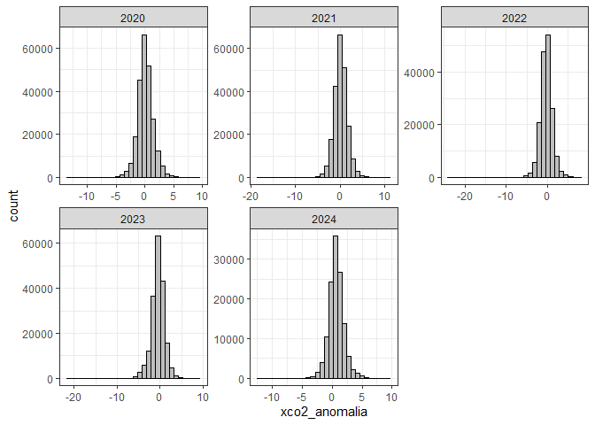<!-- -->

#### Plotando gráfico da distribuição de xco2 com tendencia por ano

#### separado por semestre

``` r
data_set_xco2_anomal %>%

   ggplot(aes(x = xco2, y = as.factor(year))) +

   geom_density_ridges(
     rel_min_height = 0.03,
     alpha = .6,
     color = "black"
   ) +

   scale_fill_viridis_d(name = "Epoca") +
   coord_cartesian(xlim = c(405, 425)) +
   theme_ridges() +

   labs(
     # title = "Distribuição Epoca de XCO₂ por Ano",
     x = expression(paste(CO[2]," (ppm)")),
     y = "Ano"
   )
```

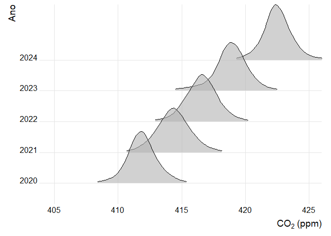<!-- -->

#### Plotando gráfico da distribuição de xco2 sem tendencia por ano

#### separado por semestre

``` r
data_set_xco2_anomal_sem_tendencia %>%

   ggplot(aes(x = xco2, y = as.factor(year))) +

   geom_density_ridges(
     rel_min_height = 0.03,
     alpha = .6,
     color = "black"
   ) +

   scale_fill_viridis_d(name = "Epoca") +
   coord_cartesian(xlim = c(400, 415)) +
   theme_ridges() +

   labs(
     title = "Distribuição Epoca de XCO2 por Ano",
     x = "Concentração de XCO2 (ppm)",
     y = "Ano"
   )
```

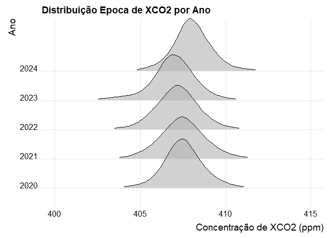<!-- -->

#### Anomalia de xco2, criando a coluna.

``` r
# data_set_xco2_com_tendencia <- data_set_xco2 %>%
# 
#   filter(xco2_quality_flag == 0,
#         year >= 2020 & year <= 2025) %>%
# 
#  group_by(year, month) %>% #MON
# 
#   mutate(
#     xco2_anomaly = xco2 - median(xco2, na.rm = TRUE)
#   ) %>%
# 
#  ungroup()
```

#### Anomalia de xco2 com tendencia

``` r
data_set_xco2_anomal %>%
   ggplot(aes(x = xco2_anomalia, y = as.factor(year))) +

   geom_density_ridges(
     rel_min_height = 0.03,
     alpha = .6,
     color = "black"
   ) +
     geom_vline(xintercept = 0, linetype = "dashed", color = "black") +

     scale_fill_manual(
       name = "Epoca",
       values = c(
         "Chuvosa. (Jan-Jun)" = "blue", # Tom de roxo/lilás
         "Seca. (Jul-Dez)" = "yellow"  # Tom de amarelo claro
       )
     ) +
  coord_cartesian(xlim = c(-5, 5))+
  theme_ridges()
```

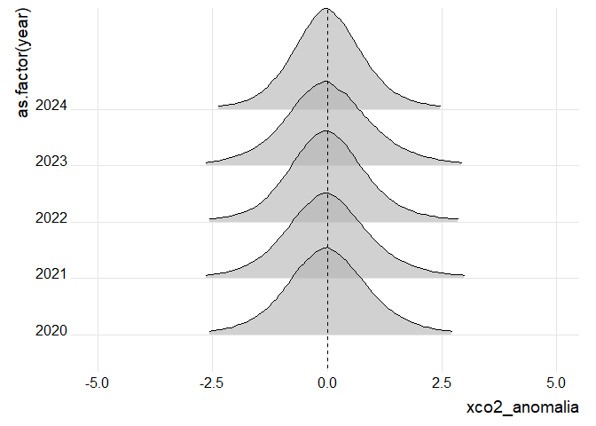<!-- -->

#### Anomalia de xco2 sem tendencia

``` r
data_set_xco2_anomal_sem_tendencia %>%
    ggplot(aes(x = xco2_anomalia, y = as.factor(year))) +

    geom_density_ridges(
      rel_min_height = 0.03,
      alpha = .6,
      color = "black"
    ) +
    geom_vline(xintercept = 0, linetype = "dashed", color = "black") +

    scale_fill_manual(
      name = "Epoca",
      values = c(
        "Chuvosa. (Jan-Jun)" = "blue",
        "Seca. (Jul-Dez)" = "yellow"
      )
    ) +
    coord_cartesian(xlim = c(-5, 5))+
  theme_ridges()
```

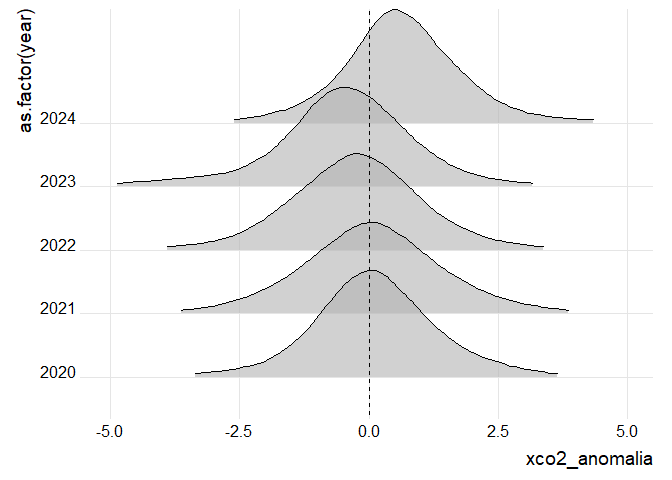<!-- -->

#### Observando dados de anomalia

``` r
 dados_temporais <- data_set_xco2_anomal %>%
  mutate(
      epoca = case_when(
        month %in% 1:6  ~ "Chuvosa (Jan-Jun)",
        month %in% 7:12 ~ "Seca (Jul-Dez)"
      )
    ) %>%
  mutate(
      epoca = factor(epoca, levels = c("Chuvosa (Jan-Jun)", "Seca (Jul-Dez)"))
    ) %>%
  group_by(year, epoca) %>%
  summarise(
      anomalia_media = mean(xco2_anomalia, na.rm = TRUE),
      desvio_padrao = sd(xco2_anomalia, na.rm = TRUE),
      .groups = "drop"
    ) %>%
  mutate(
      mes_representativo = case_when(
        epoca == "Chuvosa (Jan-Jun)" ~ 3,
        epoca == "Seca (Jul-Dez)"    ~ 9
      ),
      data = as.Date(paste(year, mes_representativo, "15", sep = "-"))
    )
print(dados_temporais)
#> # A tibble: 10 × 6
#>     year epoca        anomalia_media desvio_padrao mes_representativo data      
#>    <dbl> <fct>                 <dbl>         <dbl>              <dbl> <date>    
#>  1  2020 Chuvosa (Ja…        0.00640         1.26                   3 2020-03-15
#>  2  2020 Seca (Jul-D…        0.0184          1.01                   9 2020-09-15
#>  3  2021 Chuvosa (Ja…        0.0483          1.21                   3 2021-03-15
#>  4  2021 Seca (Jul-D…        0.0333          1.09                   9 2021-09-15
#>  5  2022 Chuvosa (Ja…        0.0627          1.13                   3 2022-03-15
#>  6  2022 Seca (Jul-D…        0.0207          1.01                   9 2022-09-15
#>  7  2023 Chuvosa (Ja…        0.0397          1.29                   3 2023-03-15
#>  8  2023 Seca (Jul-D…        0.0348          1.03                   9 2023-09-15
#>  9  2024 Chuvosa (Ja…        0.0313          1.11                   3 2024-03-15
#> 10  2024 Seca (Jul-D…        0.00856         0.902                  9 2024-09-15
```

#### Estatistica do xco2 - com tendencia

``` r

dados_xco2_mensais <- data_set_xco2_anomal %>%
  group_by(year, month) %>%
  summarise(
    xco2_media = mean(xco2, na.rm = TRUE),
    xco2_sd = sd(xco2, na.rm = TRUE),
    .groups = "drop"  
  ) %>%
  mutate(
    data = as.Date(paste(year, month, "15", sep = "-")),
    epoca = case_when(
      month %in% 1:6  ~ "Chuvosa (Jan-Jun)",
      month %in% 7:12 ~ "Seca (Jul-Dez)"
    ),
    epoca = factor(epoca, levels = c("Chuvosa (Jan-Jun)", "Seca (Jul-Dez)"))
  ) %>%
  arrange(data)

ggplot(dados_xco2_mensais, aes(x = data, y = xco2_media, color = epoca, fill = epoca)) +
  
  geom_ribbon(aes(ymin = xco2_media - xco2_sd, ymax = xco2_media + xco2_sd), alpha = 0.3, color = NA) +
  
  geom_line(linewidth = 1) +
  
  geom_point(size = 2.5) +
  
  scale_color_manual(values = c("Chuvosa (Jan-Jun)" = "blue", "Seca (Jul-Dez)" = "orange")) +
  scale_fill_manual(values = c("Chuvosa (Jan-Jun)" = "blue", "Seca (Jul-Dez)" = "orange")) +
  
  scale_x_date(
    breaks = "1 year",  
    date_labels = "%b %Y"
  ) +
  
  labs(
    title = "Série Temporal Mensal de XCO2 com tendencia",
    subtitle = "Média e Desvio Padrão para cada mês, com cores por época",
    x = "Data",
    y = "Concentração Média de XCO₂ (ppm)",
    color = "Época",
    fill = "Época"
  ) +
  theme_minimal() +
  theme(
    legend.position = "bottom",
    axis.text.x = element_text(angle = 45, hjust = 1)
  )
```

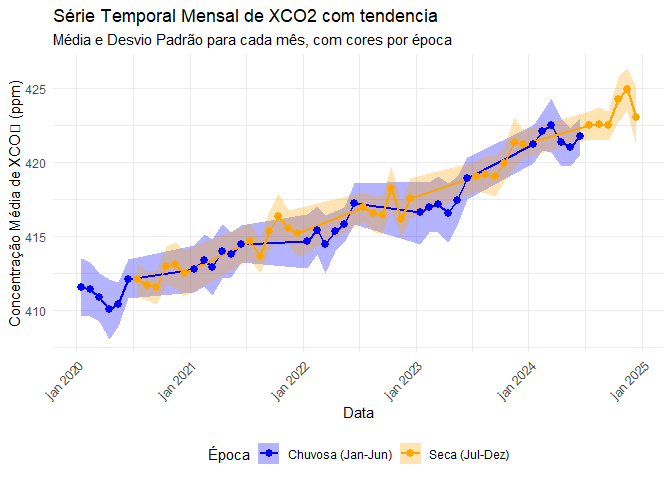<!-- -->

#### Estatistica do xco2 - SEM tendencia

``` r
dados_xco2_mensais <- data_set_xco2_anomal_sem_tendencia %>%
  group_by(year, month) %>%
  summarise(
    xco2_media = mean(xco2, na.rm = TRUE),
    xco2_sd = sd(xco2, na.rm = TRUE),
    .groups = "drop"  
  ) %>%
  mutate(
    data = as.Date(paste(year, month, "15", sep = "-")),
    epoca = case_when(
      month %in% 1:6  ~ "1° semestre (Jan-Jun)", # Corrigido para "semestre"
      month %in% 7:12 ~ "2° semestre (Jul-Dez)"
    ),
    epoca = factor(epoca, levels = c("1° semestre (Jan-Jun)", "2° semestre (Jul-Dez)"))
  ) %>%
  arrange(data)

ggplot(dados_xco2_mensais, aes(x = data, y = xco2_media, color = epoca, fill = epoca)) +
  
  geom_ribbon(aes(ymin = xco2_media - xco2_sd, ymax = xco2_media + xco2_sd), alpha = 0.3, color = NA) +
  
  geom_line(linewidth = 1) +
  
  geom_point(size = 2.5) +
  
  scale_color_manual(values = c("1° semestre (Jan-Jun)" = "blue", "2° semestre (Jul-Dez)" = "orange")) +
  scale_fill_manual(values = c("1° semestre (Jan-Jun)" = "blue", "2° semestre (Jul-Dez)" = "orange")) + # Alterado para "lightblue" para ficar mais claro
  
  scale_x_date(
    breaks = "1 year",  
    date_labels = "%b %Y"
  ) +
  
  labs(
    x = "Data",
    y = "Concentração Média de XCO₂ (ppm)",
    color = "Época",
    fill = "Época"
  ) +
  theme_minimal() +
  theme(
    legend.position = "bottom",
    axis.text.x = element_text(angle = 45, hjust = 1)
  )
```

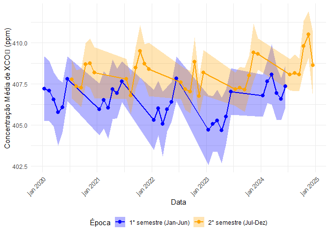<!-- -->
